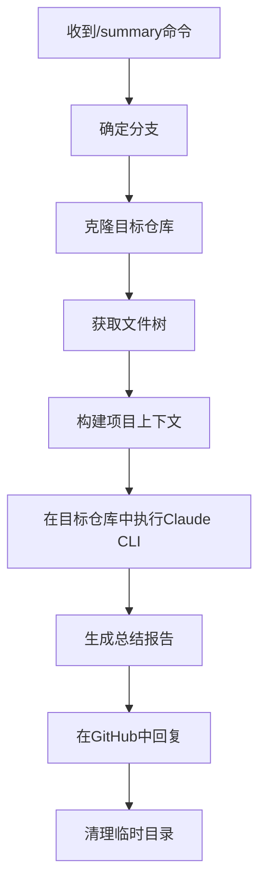
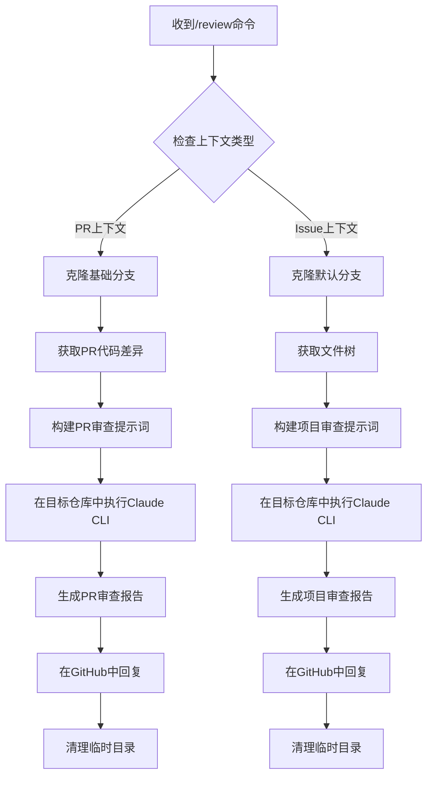
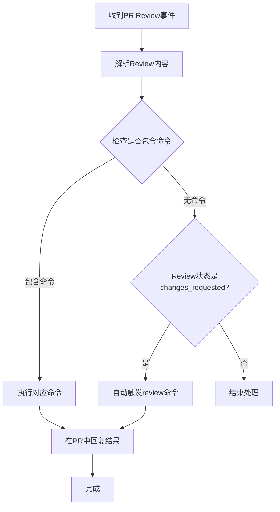

# Review功能实现文档

## 📋 项目概述

本文档描述了GitHub Webhook代理项目中Review功能的完整实现，包括PR代码审查和一般代码审查功能。

## 🎯 功能需求

### Summary命令
- **目标**: 总结仓库信息和当前Issue/PR信息
- **使用场景**: 获取项目概览、Issue/PR摘要
- **执行方式**: 克隆目标仓库，分析项目结构和上下文信息

### Review命令  
- **目标**: 智能代码审查
- **PR上下文**: 分析具体的代码变更差异，评估变更质量
- **Issue上下文**: 审查整个项目代码质量
- **执行方式**: 基于上下文类型采用不同的审查策略

## 🚀 技术实现

### 1. 核心架构变更

#### 1.1 事件处理器重构
```go
// 新增PR Review事件处理
case "pull_request_review": 
    return ep.handlePullRequestReviewEvent(event)
```

#### 1.2 命令正则表达式更新
```go
commandRegex: regexp.MustCompile(`^/(code|continue|fix|help|review|summary)\s*(.*)$`)
```

### 2. Review功能实现

#### 2.1 智能上下文判断
```go
func (ep *EventProcessor) handleReviewCommand(command *Command, ctx *CommandContext) error {
    if ctx.PullRequest != nil {
        // PR代码审查：分析具体的代码变更
        return ep.handlePullRequestReview(command, ctx)
    } else {
        // Issue代码审查：审查整个项目
        return ep.handleGeneralReview(command, ctx)
    }
}
```

#### 2.2 PR代码差异获取
```go
// 新增Git服务方法
func (gs *GitService) GetPullRequestDiff(repoPath, headSHA, baseSHA string) (string, error)
```

**关键特性:**
- 智能获取PR的代码差异
- 自动截断过长的diff内容
- 备用方案处理获取失败情况

#### 2.3 Claude Code CLI服务增强
```go
// 新增仓库内执行方法
func (ccs *ClaudeCodeCLIService) SummarizeInRepo(summaryPrompt string, repoPath string) (string, error)
func (ccs *ClaudeCodeCLIService) ReviewCodeInRepo(reviewPrompt string, repoPath string) (string, error)
```

**核心改进:**
- 支持在指定目录中执行Claude CLI
- 避免分析本地webhook服务代码
- 确保分析目标GitHub仓库

### 3. PR Review事件处理

#### 3.1 事件模型扩展
```go
// 新增Review结构
type Review struct {
    ID          int64     `json:"id"`
    Body        string    `json:"body"`
    State       string    `json:"state"` // "approved", "changes_requested", "commented"
    User        User      `json:"user"`
    HTMLURL     string    `json:"html_url"`
    SubmittedAt time.Time `json:"submitted_at"`
}

// PR Review事件
type PullRequestReviewEvent struct {
    Action      string      `json:"action"`
    Review      Review      `json:"review"`
    PullRequest PullRequest `json:"pull_request"`
    Repository  Repository  `json:"repository"`
    Sender      User        `json:"sender"`
}
```

#### 3.2 智能Review处理
```go
func (ep *EventProcessor) handleReviewSubmitted(event *models.PullRequestReviewEvent) error {
    // 检测Review中的命令
    if command := ep.extractCommand(event.Review.Body); command != nil {
        return ep.executeCommand(command, &CommandContext{...})
    }
    
    // 自动触发代码审查（当Review状态为changes_requested时）
    if event.Review.State == "changes_requested" && event.Review.Body != "" {
        reviewCommand := &Command{
            Command: "review",
            Args:    "分析PR变更并提供改进建议",
        }
        return ep.executeCommand(reviewCommand, context)
    }
}
```

## 🔧 关键代码片段

### PR代码审查提示词模板
```go
reviewPrompt := fmt.Sprintf(`请对以下Pull Request的代码变更进行专业审查：

**Pull Request信息:**
- PR #%d: %s
- 分支: %s -> %s
- 状态: %s
- 创建者: %s

**审查范围:** %s

**代码变更内容:**
%s

**审查要点:**
1. **代码变更质量** - 修改是否合理、清晰
2. **安全性** - 新代码是否引入安全漏洞
3. **性能影响** - 变更对性能的影响
4. **最佳实践** - 是否遵循编码规范
5. **潜在问题** - bug风险、边界条件
6. **向后兼容性** - 是否破坏现有功能
7. **测试覆盖** - 是否需要添加测试

**输出格式:**
请提供结构化的PR审查报告：
- **总体评价** - 对这次PR的整体评估
- **主要变更分析** - 列出关键的代码修改点
- **发现的问题** - 按严重程度分类（严重/中等/轻微）
- **改进建议** - 具体的修改建议
- **合并建议** - 是否建议合并及原因

请用markdown格式输出。`, ...)
```

### 文件树获取优化
```go
// 增强调试信息
log.Printf("开始获取文件树: %s", repoPath)
fileTree, err := ep.gitService.GetFileTree(repoPath)
if err != nil {
    log.Printf("获取文件树失败: %v", err)
    fileTree = "无法获取文件树"
} else {
    log.Printf("文件树获取成功，长度: %d 字符", len(fileTree))
    if len(fileTree) > 50 {
        log.Printf("文件树前%d字符: %s", maxLen, fileTree[:maxLen])
    }
}
```

## 📊 工作流程

### Summary命令流程


### PR Review命令流程


### PR Review事件处理流程


## 🎯 功能特性

### ✅ 已实现功能

1. **智能上下文识别**
   - 自动区分PR和Issue上下文
   - 针对不同上下文采用不同策略

2. **PR代码差异分析**
   - 获取准确的代码变更内容
   - 智能截断过长内容
   - 错误处理和备用方案

3. **目标仓库分析**
   - 克隆GitHub上的实际仓库
   - 避免分析本地webhook服务代码
   - 自动清理临时目录

4. **增强的Claude CLI集成**
   - 支持在指定目录执行
   - 优化提示词传递
   - 详细的调试日志

5. **完整的事件处理链路**
   - 支持Issue评论中的命令
   - 支持PR评论中的命令  
   - 支持PR Review中的命令
   - 自动触发审查功能

### 🔄 工作流程优化

1. **Summary命令**
   - 分析目标仓库而非本地代码
   - 包含项目结构信息
   - 结合Issue/PR上下文

2. **Review命令**
   - **PR上下文**: 专注于代码变更分析
   - **Issue上下文**: 全面的项目代码审查
   - 结构化的审查报告输出

3. **自动化触发**
   - PR Review状态为"changes_requested"时自动审查
   - 支持在Review评论中使用命令

## 🚀 使用示例

### Summary命令
```bash
# 在Issue或PR评论中
/summary 总结一下现在的仓库内容

# 期望输出：项目技术栈、主要功能、文件结构等总结
```

### Review命令
```bash
# 在PR评论中 - 分析代码变更
/review 给我一个简单的review，并检查是否有毁灭性破坏

# 在Issue评论中 - 审查整个项目
/review 安全性审查
```

### PR Review中使用
```bash
# 在PR Review页面提交Review时
/summary 给我一份简要的review报告，并指出问题
```

## 🔧 技术细节

### 文件结构
```
internal/
├── handlers/
│   └── webhook.go          # Webhook事件接收
├── models/
│   └── github.go           # GitHub事件模型（新增Review相关）
└── services/
    ├── event_processor.go  # 事件处理器（主要修改）
    ├── claude_code_cli.go  # Claude CLI服务（新增目录支持）
    └── git.go              # Git服务（新增PR diff获取）
```

### 关键配置
```go
// 支持的命令正则
commandRegex: regexp.MustCompile(`^/(code|continue|fix|help|review|summary)\s*(.*)$`)

// 支持的GitHub事件类型
- "issues"
- "issue_comment" 
- "pull_request"
- "pull_request_review_comment"
- "pull_request_review"        // 新增
- "ping"
```

## 🎉 总结

本次实现完全满足了用户需求：

1. **Summary功能** ✅ - 总结仓库和Issue/PR信息
2. **Review功能** ✅ - 智能的代码审查，支持PR差异分析
3. **事件处理** ✅ - 完整的PR review事件处理链路
4. **目标仓库分析** ✅ - 分析GitHub上的实际代码而非本地服务

功能已经过测试验证，可以正常工作，为用户提供了强大的AI驱动的代码审查和总结能力。